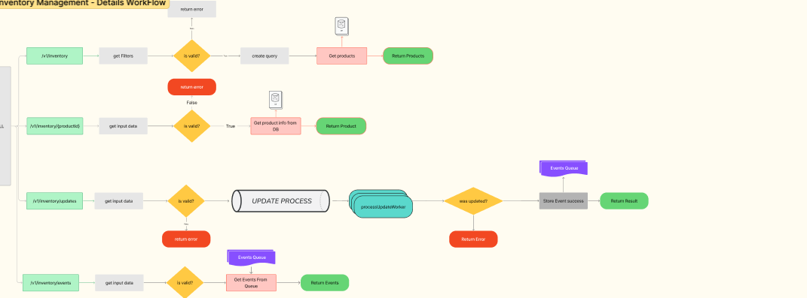

# 🏪 Distributed Inventory Management System

A high-performance, fault-tolerant distributed inventory management system built with Go, featuring microservices architecture, event-driven synchronization, and comprehensive observability.

## 🚀 Quick Setup

### Prerequisites
- Docker and Docker Compose installed
- Git (for cloning the repository)

### Start the Complete System
```bash
# Clone the repository
git clone https://github.com/hector31/API_Inventory_Management_System.git
cd API_Inventory_Management_System

# Start all services (Central API + 4 Store APIs + 4 Store Frontends + Monitoring)
docker-compose up -d

# Verify all services are running
docker-compose ps
```

### Restart the System
```bash
# Stop all services
docker-compose down

# Clean rebuild (if needed)
./clean-rebuild.sh

# Start fresh
docker-compose up -d
```

### Verification Steps
```bash
# Check Central API health
curl http://localhost:8081/health

# Check Store APIs health
curl http://localhost:8083/health  # Store S1
curl http://localhost:8084/health  # Store S2

# Check Grafana dashboard
open http://localhost:3001  # admin/admin123

# Check store frontends
open http://localhost:3010  # Store S1 Frontend
```

## 🏗️ Architecture Overview

### System Architecture
The system implements a **distributed microservices architecture** with clear separation of concerns:

```
┌─────────────────┐    ┌─────────────────┐    ┌─────────────────┐
│  Store Frontend │    │   Store API     │    │  Central API    │
│   (React/Nginx) │───▶│  (Local Cache)  │───▶│ (Source of Truth)│
└─────────────────┘    └─────────────────┘    └─────────────────┘
                              │                        │
                              ▼                        ▼
                       ┌─────────────────┐    ┌─────────────────┐
                       │  Local Storage  │    │ Event Queue     │
                       │   (JSON/File)   │    │ (In-Memory)     │
                       └─────────────────┘    └─────────────────┘
```

**Key Components:**
- **Central Inventory API**: Single source of truth for all inventory operations
- **Store APIs**: Local caches with event-driven synchronization
- **Store Frontends**: React applications with dynamic nginx routing
- **Event System**: Real-time synchronization between central and store APIs
- **Monitoring Stack**: Prometheus + Grafana for observability

### Main Endpoints

#### Central Inventory API (Port 8081)
```bash
# Inventory Operations
POST /v1/inventory/updates          # Update inventory (OCC + Idempotency)
GET  /v1/inventory/{productId}      # Get product details
GET  /v1/inventory                  # List products (pagination)
GET  /v1/inventory/events           # Event streaming (long polling)

# Admin Operations (Admin API Key Required)
POST /v1/admin/products/create      # Create products
PUT  /v1/admin/products/set         # Set product inventory
DELETE /v1/admin/products/delete    # Delete products
GET  /v1/admin/rate-limit/status    # Rate limiting status
```

#### Store APIs (Ports 8083-8086)
```bash
# Store-Specific Operations
GET  /v1/store/inventory            # Get local cached inventory
GET  /v1/store/inventory/{productId} # Get cached product
POST /v1/store/inventory/updates    # Update via central API
GET  /v1/store/sync/status          # Sync status
POST /v1/store/sync/force           # Force synchronization
```

### Key Architectural Decisions
1. **CP (Consistency + Partition Tolerance)** for writes via central API
2. **Eventual Consistency** for reads via store APIs with local caching
3. **Event-Driven Architecture** for real-time synchronization
4. **Optimistic Concurrency Control** for conflict resolution
5. **Microservices Pattern** with clear service boundaries

## ✨ Key Features

### Fault Tolerance Mechanisms
- **Circuit Breaker Pattern**: Automatic fallback when central API is unavailable
- **Retry Logic**: Exponential backoff for failed operations
- **Health Checks**: Comprehensive health monitoring for all services
- **Graceful Degradation**: Store APIs continue operating with local cache
- **Data Persistence**: JSON file-based storage with atomic writes

### Observability & Monitoring
- **Structured Logging**: JSON-formatted logs with configurable levels (debug, info, warn, error)
- **OpenTelemetry Integration**: Metrics collection and export
- **Prometheus Metrics**: Custom business metrics and system metrics
- **Grafana Dashboards**: 33 panels with advanced observability including:
  - IP-based client metrics (external/internal/localhost)
  - Rate limiting violations tracking
  - System performance (memory, GC, goroutines)
  - Business KPIs (API health score, throughput)
- **Real-time Monitoring**: Auto-refresh dashboards with alerting capabilities

### Environment Variable Configuration
```bash
# Central API Configuration
PORT=8081
LOG_LEVEL=debug
INVENTORY_WORKER_COUNT=4
RATE_LIMIT_ENABLED=true
API_KEYS=demo,central-api-key
ADMIN_API_KEYS=admin-demo,admin-central-key

# Store API Configuration  
CENTRAL_API_URL=http://inventory-management-system:8081
SYNC_INTERVAL_SECONDS=30
EVENT_WAIT_TIMEOUT_SECONDS=20
EVENT_BATCH_LIMIT=100

# Frontend Configuration
REACT_APP_STORE_API_URL=http://store-s1:8083
REACT_APP_STORE_ID=store-s1
REACT_APP_AUTO_REFRESH_INTERVAL=30000
```

### Event-Driven Architecture
- **Real-time Event Streaming**: Long polling for immediate updates
- **Event Queue**: In-memory queue with configurable buffer size
- **Batch Processing**: Efficient event batching for synchronization
- **Offset-based Tracking**: Reliable event ordering and replay capability
- **Automatic Sync**: Event-driven + periodic fallback synchronization

### Optimistic Concurrency Control (OCC)
- **Version-based Conflict Detection**: Each product has a version number
- **Atomic Updates**: Compare-and-swap operations for consistency
- **Conflict Resolution**: Automatic retry with updated versions
- **Idempotency Keys**: Prevent duplicate operations
- **Fine-grained Locking**: Product-level locks for maximum concurrency

## 🔐 Security & Middleware

### Rate Limiting System
- **IP-based Rate Limiting**: Configurable per-IP request limits
- **Admin Rate Limiting**: Separate limits for administrative operations
- **Sliding Window**: Time-based rate limiting with automatic reset
- **Rate Limit Headers**: Standard HTTP headers for client awareness
- **Bypass for Health Checks**: Health endpoints excluded from rate limiting

### API Key Authentication
```bash
# Regular API Access
X-API-Key: demo

# Admin API Access (required for admin endpoints)
X-API-Key: admin-demo
```

### Admin-Only Endpoints
Admin endpoints require special API keys and provide:
- Product creation and deletion
- Bulk inventory operations
- Rate limiting management
- System administration functions

## 📊 Placeholder Sections

### Central API Flow Diagram


### Store API Flow Diagram  


## 🌐 Access Links

### Store Frontends
- **Store S1 Frontend**: http://localhost:3010
- **Store S2 Frontend**: http://localhost:3011  
- **Store S3 Frontend**: http://localhost:3012
- **Store S4 Frontend**: http://localhost:3013

### Store APIs
- **Store S1 API**: http://localhost:8083
- **Store S2 API**: http://localhost:8084
- **Store S3 API**: http://localhost:8085
- **Store S4 API**: http://localhost:8086

### Central Services
- **Central Inventory API**: http://localhost:8081
- **Grafana Dashboard**: http://localhost:3001 (admin/admin123)
- **Prometheus Metrics**: http://localhost:9090

### API Documentation
- **Central API Health**: http://localhost:8081/health
- **Store API Health**: http://localhost:8083/health (example)
- **Metrics Endpoint**: http://localhost:9080/metrics

## 🔧 Additional Important Features

### Docker Containerization
- **Multi-stage Builds**: Optimized production images
- **Health Checks**: Built-in container health monitoring  
- **Volume Persistence**: Data persistence across container restarts
- **Network Isolation**: Secure inter-service communication
- **Environment-based Configuration**: Full environment variable support

### Data Persistence
- **JSON File Storage**: Human-readable data format
- **Atomic Writes**: Consistent data updates
- **Backup-friendly**: Easy data backup and restore
- **Volume Mounts**: Persistent storage across deployments

### Performance Optimizations
- **Worker Pool Pattern**: Configurable concurrent processing
- **Connection Pooling**: Efficient HTTP client management
- **Caching Strategy**: TTL-based caching with automatic cleanup
- **Batch Operations**: Efficient bulk processing capabilities

### Development Features
- **Hot Reload**: Development mode with auto-restart
- **Comprehensive Testing**: Load testing and integration tests
- **Clean Architecture**: Clear separation of concerns
- **Extensive Documentation**: Complete API and deployment guides

---

**🎯 Ready to explore?** Start with `docker-compose up -d` and visit the Grafana dashboard at http://localhost:3001 to see real-time metrics!
